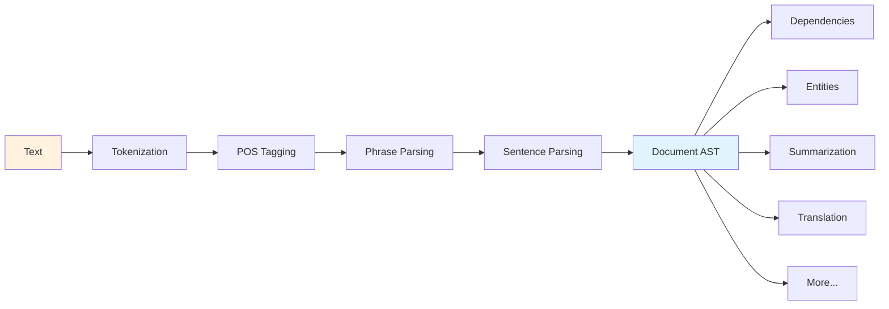

#  Nasty → Natural Abstract Syntax Tree Yeoman

[](https://github.com/am-kantox/nasty/actions)
[](https://codecov.io/gh/am-kantox/nasty)
[](https://hex.pm/packages/nasty)
[](https://hexdocs.pm/nasty/)

**A comprehensive NLP library for Elixir that treats natural language with the same rigor as programming languages.**

Nasty provides a complete grammatical Abstract Syntax Tree (AST) for multiple natural languages (English, Spanish, and Catalan), with a full NLP pipeline from tokenization to text summarization.

- **Tokenization** - NimbleParsec-based text segmentation
- **POS Tagging** - Rule-based + Statistical (HMM with Viterbi) + Neural (BiLSTM-CRF)
- **Morphological Analysis** - Lemmatization and features
- **Phrase Structure Parsing** - NP, VP, PP, and relative clauses
- **Complex Sentences** - Coordination, subordination
- **Dependency Extraction** - Universal Dependencies relations
- **Named Entity Recognition** - Person, place, organization
- **Semantic Role Labeling** - Predicate-argument structure (who did what to whom)
- **Coreference Resolution** - Link mentions across sentences
- **Text Summarization** - Extractive summarization with MMR
- **Question Answering** - Extractive QA for factoid questions
- **Text Classification** - Multinomial Naive Bayes classifier with multiple feature types
- **Information Extraction** - Relation extraction, event extraction, and template-based extraction
- **Statistical Models** - HMM POS tagger with 95% accuracy
- **Neural Models** - BiLSTM-CRF with 97-98% accuracy using Axon/EXLA
- **Code Interoperability** - Bidirectional NL ↔ Code conversion (Natural language commands to Elixir code and vice versa)
- **AST Rendering** - Convert AST back to natural language text
- **Translation** - AST-based translation with morphological agreement and word order transformations
- **AST Utilities** - Traversal, queries, validation, and transformations
- **Visualization** - Export to DOT/Graphviz and JSON formats
- **Multi-Language Support** - English, Spanish, and Catalan with language-agnostic architecture

## Quick Start

```bash
# Run the complete demo
mix run demo.exs

# Or try specific examples
mix run examples/catalan_example.exs
mix run examples/roundtrip_translation.exs
mix run examples/multilingual_pipeline.exs
```

New to Nasty? Start with the [Getting Started Guide](docs/GETTING_STARTED.md) for a beginner-friendly tutorial.

```elixir
alias Nasty.Language.English

# Simple example
text = "John Smith works at Google in New York."

{:ok, tokens} = English.tokenize(text)
{:ok, tagged} = English.tag_pos(tokens)
{:ok, document} = English.parse(tagged)

# Extract entities
alias Nasty.Language.English.EntityRecognizer
entities = EntityRecognizer.recognize(tagged)
# => [%Entity{type: :person, text: "John Smith"}, 
#     %Entity{type: :org, text: "Google"}, ...]

# Extract dependencies
alias Nasty.Language.English.DependencyExtractor
sentences = document.paragraphs |> Enum.flat_map(& &1.sentences)
deps = Enum.flat_map(sentences, &DependencyExtractor.extract/1)

# Semantic role labeling
{:ok, document_with_srl} = Nasty.Language.English.parse(tagged, semantic_roles: true)
# Access semantic frames
frames = document_with_srl.semantic_frames
# => [%SemanticFrame{predicate: "works", roles: [%Role{type: :agent, text: "John Smith"}, ...]}]

# Coreference resolution
{:ok, document_with_coref} = Nasty.Language.English.parse(tagged, coreference: true)
# Access coreference chains
chains = document_with_coref.coref_chains
# => [%CorefChain{representative: "John Smith", mentions: ["John Smith", "he"], ...}]

# Summarize
summary = English.summarize(document, ratio: 0.3)  # 30% compression
# or
summary = English.summarize(document, max_sentences: 3)  # Fixed count

# MMR (Maximal Marginal Relevance) for reduced redundancy
summary_mmr = English.summarize(document, max_sentences: 3, method: :mmr, mmr_lambda: 0.5)

# Question answering
{:ok, answers} = English.answer_question(document, "Who works at Google?")
# => [%Answer{text: "John Smith", confidence: 0.85, ...}]

# Statistical POS tagging (auto-loads from priv/models/)
{:ok, tokens_hmm} = English.tag_pos(tokens, model: :hmm)

# Neural POS tagging (97-98% accuracy)
{:ok, tokens_neural} = English.tag_pos(tokens, model: :neural)

# Or ensemble mode (combines neural + statistical + rule-based)
{:ok, tokens_ensemble} = English.tag_pos(tokens, model: :ensemble)

# Text classification
# Train a sentiment classifier
training_data = [
  {positive_doc1, :positive},
  {positive_doc2, :positive},
  {negative_doc1, :negative},
  {negative_doc2, :negative}
]
model = English.train_classifier(training_data, features: [:bow, :lexical])

# Classify new documents
{:ok, predictions} = English.classify(test_doc, model)
# => [%Classification{class: :positive, confidence: 0.85, ...}, ...]

# Information extraction
# Extract relations between entities
{:ok, relations} = English.extract_relations(document)
# => [%Relation{type: :works_at, subject: person, object: org, confidence: 0.8}]

# Extract events with participants
{:ok, events} = English.extract_events(document)
# => [%Event{type: :business_acquisition, trigger: "acquired", participants: %{agent: ..., patient: ...}}]

# Template-based extraction
templates = [TemplateExtractor.employment_template()]
{:ok, results} = English.extract_templates(document, templates)
# => [%{template: "employment", slots: %{employee: "John", employer: "Google"}, confidence: 0.85}]
```

## Architecture



### Complete Pipeline

1. **Tokenization** (`English.Tokenizer`) → Split text into tokens
2. **POS Tagging** (`English.POSTagger`) → Assign grammatical categories
3. **Morphology** (`English.Morphology`) → Lemmatization and features
4. **Phrase Parsing** (`English.PhraseParser`) → Build NP, VP, PP structures
5. **Sentence Parsing** (`English.SentenceParser`) → Detect clauses and structure
6. **Dependency Extraction** (`English.DependencyExtractor`) → Grammatical relations
7. **Entity Recognition** (`English.EntityRecognizer`) → Named entities
8. **Semantic Role Labeling** (`English.SemanticRoleLabeler`) → Predicate-argument structure
9. **Coreference Resolution** (`English.CoreferenceResolver`) → Link mentions
10. **Summarization** (`English.Summarizer`) → Extract key sentences
11. **Question Answering** (`English.QuestionAnalyzer`, `English.AnswerExtractor`) → Answer questions
12. **Text Classification** (`English.FeatureExtractor`, `English.TextClassifier`) → Train and classify documents
13. **Information Extraction** (`English.RelationExtractor`, `English.EventExtractor`, `English.TemplateExtractor`) → Extract structured information
14. **AST Rendering** (`Rendering.Text`) → Convert AST back to natural language
15. **AST Utilities** (`Utils.Traversal`, `Utils.Query`, `Utils.Validator`, `Utils.Transform`) → Traverse, query, validate, and transform trees
16. **Visualization** (`Rendering.Visualization`, `Rendering.PrettyPrint`) → Export to DOT/JSON and debug output

## Features

### Phrase Structures
- Noun Phrases (NP): `Det? Adj* Noun PP* RelClause*`
- Verb Phrases (VP): `Aux* Verb NP? PP* Adv*`
- Prepositional Phrases (PP): `Prep NP`
- Relative Clauses: `RelPron/RelAdv Clause`

### Sentence Types
- Simple, Compound, Complex sentences
- Coordination (and, or, but)
- Subordination (because, although, if)
- Relative clauses (who, which, that)

### Dependencies (Universal Dependencies)
- Core arguments: `nsubj`, `obj`, `iobj`
- Modifiers: `amod`, `advmod`, `det`, `case`
- Clausal: `acl`, `advcl`, `mark`
- Coordination: `conj`, `cc`

### Entity Types
- Person, Organization, Place (GPE)
- With confidence scores and multi-word support

### Multi-Language Support

Nasty provides a language-agnostic architecture using Elixir behaviours, enabling support for multiple natural languages:

#### Supported Languages

- **English** (`Nasty.Language.English`) - Fully implemented
- **Spanish** (`Nasty.Language.Spanish`) - Fully implemented
  - Spanish-specific tokenization (¿?, ¡!, contractions del/al, accented characters)
  - Spanish morphology (verb conjugations, gender/number agreement)
  - Complete NLP pipeline (tokenization → parsing → summarization)
- **Catalan** (`Nasty.Language.Catalan`) - Fully implemented (Phases 1-7)
  - Catalan-specific tokenization (interpunct l·l, apostrophe contractions, 10 diacritics)
  - Catalan morphology (3 verb classes, irregular verbs, gender/number agreement)
  - Full parsing pipeline (phrase/sentence parsing, dependency extraction, NER)

#### Usage

```elixir
alias Nasty.Language.Spanish

# Spanish text processing
text = "El gato duerme en el sofá."
{:ok, tokens} = Spanish.tokenize(text)
{:ok, tagged} = Spanish.tag_pos(tokens)
{:ok, document} = Spanish.parse(tagged)

# Works identically to English
summary = Spanish.summarize(document, ratio: 0.3)
{:ok, entities} = Spanish.extract_entities(document)

# Catalan text processing
alias Nasty.Language.Catalan

text_ca = "El gat dorm al sofà."
{:ok, tokens_ca} = Catalan.tokenize(text_ca)
{:ok, tagged_ca} = Catalan.tag_pos(tokens_ca)
{:ok, document_ca} = Catalan.parse(tagged_ca)

# Extract entities (Catalan-specific lexicons)
alias Nasty.Language.Catalan.EntityRecognizer
{:ok, entities_ca} = EntityRecognizer.recognize(tagged_ca)

# Translate between languages (AST-based)
alias Nasty.Translation.Translator

# English to Spanish
{:ok, tokens_en} = English.tokenize("The quick cat runs.")
{:ok, tagged_en} = English.tag_pos(tokens_en)
{:ok, doc_en} = English.parse(tagged_en)
{:ok, doc_es} = Translator.translate_document(doc_en, :es)
{:ok, text_es} = Nasty.render(doc_es)
# => "El gato rápido corre."

# Spanish to English
{:ok, tokens_es} = Spanish.tokenize("La casa grande.")
{:ok, tagged_es} = Spanish.tag_pos(tokens_es)
{:ok, doc_es} = Spanish.parse(tagged_es)
{:ok, doc_en} = Translator.translate_document(doc_es, :en)
{:ok, text_en} = Nasty.render(doc_en)
# => "The big house."
```

#### Language Registry

All languages are registered in `Nasty.Language.Registry` and can be accessed dynamically:

```elixir
# Auto-detect language
{:ok, lang} = Nasty.Language.Registry.detect_language("¿Cómo estás?")
# => :es

# Get language module
{:ok, Spanish} = Nasty.Language.Registry.get(:es)
```

See complete language-specific examples:
- `examples/spanish_example.exs` - Spanish NLP pipeline demonstration
- `examples/catalan_example.exs` - Catalan tokenization, morphology, and parsing
- `examples/roundtrip_translation.exs` - Translation quality analysis with roundtrip testing
- `examples/multilingual_pipeline.exs` - Side-by-side comparison of English/Spanish/Catalan

### Text Summarization
- **Extractive summarization** - Select important sentences from document
- **Multiple scoring features**:
  - Position weight (early sentences score higher)
  - Entity density (sentences with named entities)
  - Discourse markers ("in conclusion", "importantly", etc.)
  - Keyword frequency (TF scoring)
  - Sentence length (prefer moderate length)
  - Coreference participation (sentences in coref chains)
- **Selection methods**:
  - `:greedy` - Top-N by score (default)
  - `:mmr` - Maximal Marginal Relevance (reduces redundancy)
- **Flexible options**: compression ratio or fixed sentence count

### Question Answering
- **Extractive QA** - Extract answer spans from documents
- **Question classification**:
  - WHO (person entities)
  - WHAT (things, organizations)
  - WHEN (temporal expressions)
  - WHERE (locations)
  - WHY (reasons, clauses)
  - HOW (manner, quantity)
  - YES/NO (boolean questions)
- **Answer extraction strategies**:
  - Keyword matching with lemmatization
  - Entity type filtering (person, organization, location)
  - Temporal expression recognition
  - Confidence scoring and ranking
- **Multiple answer support** with confidence scores

### Text Classification
- **Multinomial Naive Bayes** - Probabilistic classifier with Laplace smoothing
- **Multiple feature types**:
  - `:bow` - Bag of words (lemmatized, stop word filtering)
  - `:ngrams` - Word sequences (bigrams, trigrams, etc.)
  - `:pos_patterns` - POS tag sequences
  - `:syntactic` - Sentence structure statistics
  - `:entities` - Named entity distributions
  - `:lexical` - Vocabulary richness and text statistics
- **Training and prediction**:
  - Train on labeled documents: `{document, class}` tuples
  - Multi-class classification support
  - Confidence scores and probability distributions
- **Model evaluation**:
  - Accuracy, precision, recall, F1 metrics
  - Per-class performance breakdowns
- **Use cases**:
  - Sentiment analysis (positive/negative reviews)
  - Spam detection (spam/ham classification)
  - Topic classification (sports, tech, politics, etc.)
  - Formality detection (formal/informal text)

### Information Extraction
- **Relation Extraction** - Extract semantic relationships between entities
  - **Supported relations**:
    - Employment: `works_at`, `employed_by`, `member_of`
    - Organization: `founded`, `acquired_by`, `subsidiary_of`
    - Location: `located_in`, `based_in`, `headquarters_in`
    - Temporal: `occurred_on`, `founded_in`
  - Pattern-based extraction using verb patterns and prepositions
  - Confidence scoring (0.5-0.8 based on pattern strength)
  - Integrates with NER and dependency parsing

- **Event Extraction** - Identify events with triggers and participants
  - **Event types**:
    - Business: `business_acquisition`, `business_merger`, `company_founding`, `product_launch`
    - Employment: `employment_start`, `employment_end`
    - Communication: `announcement`, `meeting`
    - Other: `movement`, `transaction`
  - Verb and nominalization triggers
  - Participant extraction using semantic role labeling
  - Temporal expression linking
  - Confidence scoring (0.7-0.8)

- **Template-Based Extraction** - Structured information using custom templates
  - Define extraction templates with typed slots
  - Pre-defined templates: employment, acquisition, location
  - Flexible pattern matching
  - Required/optional slot support
  - Confidence based on slot fill rate

- **API Functions**:
  ```elixir
  # Extract relations
  {:ok, relations} = English.extract_relations(document, min_confidence: 0.6)
  
  # Extract events
  {:ok, events} = English.extract_events(document, max_events: 10)
  
  # Template extraction
  templates = [TemplateExtractor.employment_template()]
  {:ok, results} = English.extract_templates(document, templates)
  ```

### Code Interoperability

Convert between natural language and Elixir code bidirectionally:

- **NL → Code Generation** - Convert natural language commands to executable Elixir code
  - List operations: "Sort the numbers" → `Enum.sort(numbers)`
  - Filtering: "Filter users where age > 18" → `Enum.filter(users, fn item -> item > 18 end)`
  - Mapping: "Map the list" → `Enum.map(list, fn item -> item end)`
  - Arithmetic: "X plus Y" → `x + y`
  - Assignments: "X is 5" → `x = 5`
  - Conditionals: "If X then Y" → `if x, do: y`

- **Code → NL Explanation** - Generate natural language explanations from code
  - `Enum.sort(numbers)` → "sort numbers"
  - `x = a + b` → "X is a plus b"
  - `if x > 5, do: :ok` → "If x is greater than 5, then :ok"
  - Pipeline support: `list |> Enum.map(&(&1 * 2)) |> Enum.sum()` → "map list to each element times 2, then sum list"

- **API Functions**:
  ```elixir
  # Natural language → Code
  {:ok, code} = English.to_code("Sort the numbers")
  # => "Enum.sort(numbers)"
  
  # Code → Natural language
  {:ok, explanation} = English.explain_code("Enum.filter(users, fn u -> u.age > 18 end)")
  # => "filter users where u u age is greater than 18"
  
  # Get intent without generating code
  {:ok, intent} = English.recognize_intent("Filter the users")
  # => %Intent{type: :action, action: "filter", target: "users", confidence: 0.95}
  
  # Optional: Enhance with Ragex for context-aware suggestions
  {:ok, code} = English.to_code("Sort the list", enhance_with_ragex: true)
  ```

- **Example Scripts**:
  - `examples/code_generation.exs` - Natural language to code demos
  - `examples/code_explanation.exs` - Code to natural language demos

### AST Rendering & Utilities

Convert AST back to text, traverse and query trees, validate structures, and export visualizations:

- **Text Rendering** - Regenerate natural language from AST
  ```elixir
  alias Nasty.Rendering.Text
  
  # Render AST to text
  {:ok, text} = Text.render(document)
  # => "The cat sat on the mat."
  
  # Custom rendering options
  {:ok, text} = Text.render(document, 
    capitalize_sentences: false,
    add_punctuation: false,
    paragraph_separator: "\n\n"
  )
  ```

- **AST Traversal** - Walk the tree with visitor pattern
  ```elixir
  alias Nasty.Utils.Traversal
  
  # Count all tokens
  token_count = Traversal.reduce(document, 0, fn
    %Token{}, acc -> acc + 1
    _, acc -> acc
  end)
  
  # Collect all nouns
  nouns = Traversal.collect(document, fn
    %Token{pos_tag: :noun} -> true
    _ -> false
  end)
  
  # Transform tree (lowercase all text)
  lowercased = Traversal.map(document, fn
    %Token{} = token -> %{token | text: String.downcase(token.text)}
    node -> node
  end)
  ```

- **AST Queries** - High-level query API
  ```elixir
  alias Nasty.Utils.Query
  
  # Find all noun phrases
  noun_phrases = Query.find_all(document, :noun_phrase)
  
  # Find tokens by POS tag
  verbs = Query.find_by_pos(document, :verb)
  
  # Extract entities
  people = Query.extract_entities(document, type: :PERSON)
  
  # Find sentence subject
  subject = Query.find_subject(sentence)
  
  # Count nodes
  token_count = Query.count(document, :token)
  ```

- **Pretty Printing** - Debug AST structures
  ```elixir
  alias Nasty.Rendering.PrettyPrint
  
  # Indented output
  IO.puts(PrettyPrint.print(document, color: true))
  
  # Tree-style output with box characters
  IO.puts(PrettyPrint.tree(document))
  
  # Statistics
  IO.puts(PrettyPrint.stats(document))
  # => AST Statistics:
  #      Paragraphs: 3
  #      Sentences: 12
  #      Tokens: 127
  ```

- **Visualization** - Export for graphical rendering
  ```elixir
  alias Nasty.Rendering.Visualization
  
  # Export to DOT format (Graphviz)
  dot = Visualization.to_dot(document, type: :parse_tree)
  File.write("tree.dot", dot)
  # Then: dot -Tpng tree.dot -o tree.png
  
  # Dependency graph
  deps_dot = Visualization.to_dot(sentence, type: :dependencies)
  
  # Entity graph
  entity_dot = Visualization.to_dot(document, type: :entities)
  
  # JSON export for d3.js
  json = Visualization.to_json(document)
  ```

- **Validation** - Ensure AST integrity
  ```elixir
  alias Nasty.Utils.Validator
  
  # Validate structure
  {:ok, document} = Validator.validate(document)
  
  # Check spans
  :ok = Validator.validate_spans(document)
  
  # Check language consistency
  :ok = Validator.validate_language(document)
  ```

- **Transformations** - Modify AST structures
  ```elixir
  alias Nasty.Utils.Transform
  
  # Normalize case
  lowercased = Transform.normalize_case(document, :lower)
  
  # Remove punctuation
  no_punct = Transform.remove_punctuation(document)
  
  # Remove stop words
  no_stops = Transform.remove_stop_words(document)
  
  # Lemmatize all tokens
  lemmatized = Transform.lemmatize(document)
  
  # Apply pipeline of transformations
  processed = Transform.pipeline(document, [
    &Transform.normalize_case(&1, :lower),
    &Transform.remove_punctuation/1,
    &Transform.remove_stop_words/1
  ])
  ```

## Testing

```bash
# Run all tests
mix test

# Run specific module tests
mix test test/language/english/tokenizer_test.exs
mix test test/language/english/phrase_parser_test.exs
mix test test/language/english/dependency_extractor_test.exs
```

## Documentation

Comprehensive documentation is available in the `docs/` directory:

### Getting Started
- [GETTING_STARTED.md](docs/GETTING_STARTED.md) - Beginner-friendly tutorial with step-by-step examples
- [EXAMPLES.md](docs/EXAMPLES.md) - Complete catalog of all 18 example scripts with usage guides

### Core Documentation
- [PLAN.md](PLAN.md) - Original vision and architectural design
- [TODO.md](TODO.md) - Unimplemented features and future enhancements
- [PARSING_GUIDE.md](docs/PARSING_GUIDE.md) - Complete parsing algorithms reference (tokenization, POS tagging, morphology, phrase/sentence parsing, dependencies)
- [ARCHITECTURE.md](docs/ARCHITECTURE.md) - System architecture and design patterns
- [USER_GUIDE.md](docs/USER_GUIDE.md) - User guide with examples and API reference
- [API.md](docs/API.md) - Complete API reference for all modules
- [AST_REFERENCE.md](docs/AST_REFERENCE.md) - Complete AST node reference
- [PERFORMANCE.md](docs/PERFORMANCE.md) - Benchmarks, optimization tips, and performance considerations

### Language-Specific Documentation
- [ENGLISH_GRAMMAR.md](docs/languages/ENGLISH_GRAMMAR.md) - Formal English grammar specification with CFG rules
- [SPANISH.md](docs/languages/SPANISH.md) - Spanish language support details
- [CATALAN.md](docs/languages/CATALAN.md) - Catalan language support details
- [TRANSLATION.md](docs/TRANSLATION.md) - AST-based translation system guide
- [GRAMMAR_CUSTOMIZATION.md](docs/GRAMMAR_CUSTOMIZATION.md) - Guide for custom grammar rules and domain variants

## Statistical & Neural Models

Nasty includes comprehensive statistical and neural network models for state-of-the-art NLP:

### Statistical Models

#### Sequence Labeling
- **HMM POS Tagger**: Hidden Markov Model with Viterbi decoding (~95% accuracy)
- **CRF (Conditional Random Fields)**: Feature-based sequence labeling
  - Named Entity Recognition
  - POS tagging
  - Chunking and segmentation
  - Forward-backward algorithm for training
  - Viterbi decoding for prediction
  - Multiple optimization methods (SGD, Momentum, AdaGrad)

#### Parsing
- **PCFG (Probabilistic Context-Free Grammar)**: Statistical phrase structure parsing
  - CYK algorithm for efficient parsing
  - Grammar learning from treebanks
  - Chomsky Normal Form (CNF) conversion
  - Smoothing and probability estimation
  - Beam search for pruning

#### Classification
- **Naive Bayes Classifier**: Fast text classification
  - Multiple feature types (BOW, n-grams, POS patterns)
  - Laplace smoothing
  - Multi-class support

### Neural Models
- **BiLSTM-CRF**: Bidirectional LSTM with CRF for sequence tagging (97-98% accuracy)
- **Axon/EXLA**: Pure Elixir neural networks with GPU acceleration
- **Pre-trained embeddings**: Support for GloVe, FastText
- **Training infrastructure**: Train custom models on your own data
- **Evaluation metrics**: Accuracy, precision, recall, F1, confusion matrices

### Transformer Models (Bumblebee Integration)
- **Pre-trained Models**: BERT, RoBERTa, DistilBERT, XLM-RoBERTa via Hugging Face
- **Fine-tuning**: Full fine-tuning pipeline for POS tagging and NER (98-99% accuracy)
- **Zero-shot Classification**: Classify without training using NLI models (70-85% accuracy)
- **Model Quantization**: INT8 quantization for 4x compression and 2-3x speedup
- **Multilingual Support**: XLM-RoBERTa for cross-lingual transfer
- **Mix Tasks**: CLI tools for model management, fine-tuning, and inference

See [Statistical Models](docs/STATISTICAL_MODELS.md) for complete reference, [Neural Models](docs/NEURAL_MODELS.md) for neural architecture details, [Training Neural](docs/TRAINING_NEURAL.md) for training guide, [Pretrained Models](docs/PRETRAINED_MODELS.md) for transformer usage, [Zero Shot](docs/ZERO_SHOT.md) for zero-shot classification, and [Quantization](docs/QUANTIZATION.md) for model optimization.

### Quick Start: Model Management

```bash
# List available models
mix nasty.models list

# Train HMM POS tagger (fast, 95% accuracy)
mix nasty.train.pos \
  --corpus data/UD_English-EWT/en_ewt-ud-train.conllu \
  --test data/UD_English-EWT/en_ewt-ud-test.conllu \
  --output priv/models/en/pos_hmm_v1.model

# Train neural POS tagger (slower, 97-98% accuracy)
mix nasty.train.neural_pos \
  --corpus data/UD_English-EWT/en_ewt-ud-train.conllu \
  --output priv/models/en/pos_neural_v1.axon \
  --epochs 10 \
  --batch-size 32

# Train CRF for NER
mix nasty.train.crf \
  --corpus data/train.conllu \
  --test data/test.conllu \
  --output priv/models/en/ner_crf.model \
  --task ner \
  --iterations 100

# Train PCFG parser
mix nasty.train.pcfg \
  --corpus data/en_ewt-ud-train.conllu \
  --test data/en_ewt-ud-test.conllu \
  --output priv/models/en/pcfg.model \
  --smoothing 0.001

# Evaluate models
mix nasty.eval.pos \
  --model priv/models/en/pos_hmm_v1.model \
  --test data/UD_English-EWT/en_ewt-ud-test.conllu \
  --baseline

mix nasty.eval \
  --model priv/models/en/ner_crf.model \
  --test data/test.conllu \
  --type crf \
  --task ner

mix nasty.eval \
  --model priv/models/en/pcfg.model \
  --test data/test.conllu \
  --type pcfg
```

## Future Enhancements

- [x] Statistical models for improved accuracy (HMM POS tagger - done!)
- [x] Neural models (BiLSTM-CRF POS tagger with 97-98% accuracy - done!)
- [x] PCFG parser for phrase structure (done!)
- [x] CRF for named entity recognition (done!)
- [x] Semantic role labeling (rule-based SRL - done!)
- [x] Coreference resolution (heuristic-based - done!)
- [x] Question answering (extractive QA - done!)
- [x] Information extraction (relations, events, templates - done!)
- [x] Code ↔ NL bidirectional conversion (done!)
- [x] Pre-trained transformers (BERT, RoBERTa via Bumblebee - done!)
- [x] Fine-tuning infrastructure for POS tagging and NER (done!)
- [x] Zero-shot classification using NLI models (done!)
- [x] Model quantization (INT8 with 4x compression) (done!)
- [x] Integration of PCFG/CRF with main pipeline (done!)
- [x] Multi-language support - Spanish and Catalan complete
- [ ] Advanced coreference (neural models)

## License

MIT License — see LICENSE file for details.

---

**Built with ❤️ using Elixir and NimbleParsec**
