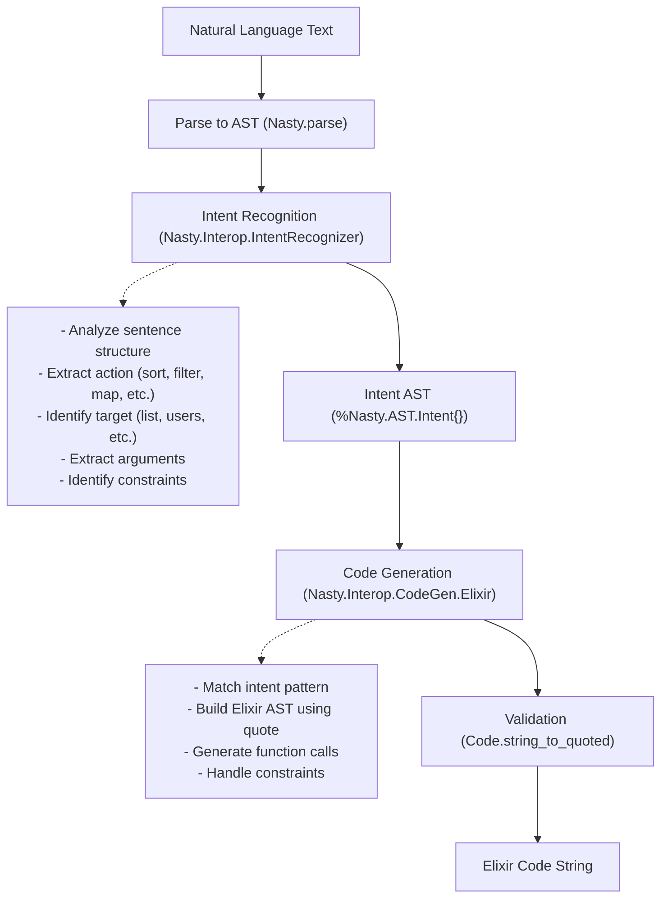
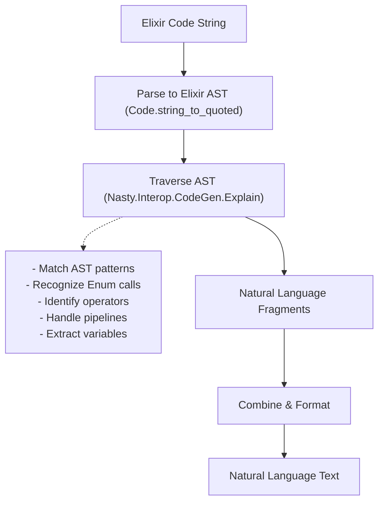

# Code Interoperability Guide

This guide explains how to use Nasty's bidirectional conversion between natural language and code.

## Overview

Nasty provides two-way interoperability:
- **NL → Code**: Convert natural language descriptions to executable code
- **Code → NL**: Generate natural language explanations from code

Currently supported: English ↔ Elixir

## Natural Language to Code

### Basic Usage

```elixir
# Simple operations
Nasty.to_code("Sort the list", 
  source_language: :en, 
  target_language: :elixir)
# => {:ok, "Enum.sort(list)"}

# Filtering
Nasty.to_code("Filter users where age is greater than 18",
  source_language: :en,
  target_language: :elixir)
# => {:ok, "Enum.filter(users, fn item -> item > 18 end)"}

# Mapping
Nasty.to_code("Map numbers to double each",
  source_language: :en,
  target_language: :elixir)
# => {:ok, "Enum.map(numbers, fn item -> item * 2 end)"}
```

### Supported Patterns

#### List Operations

**Sorting**:
```elixir
"Sort the list" → "Enum.sort(list)"
"Sort numbers" → "Enum.sort(numbers)"
```

**Filtering**:
```elixir
"Filter X where Y > Z" → "Enum.filter(x, fn item -> item > z end)"
"Filter X where Y < Z" → "Enum.filter(x, fn item -> item < z end)"
"Filter X where Y == Z" → "Enum.filter(x, fn item -> item == z end)"
```

**Multiple constraints** (AND logic):
```elixir
"Filter users where age > 18 and score > 50"
→ "Enum.filter(users, fn item -> item > 18 and item > 50 end)"
```

**Mapping**:
```elixir
"Map X" → "Enum.map(x, fn item -> item end)"
"Map X to uppercase" → "Enum.map(x, fn item -> String.upcase(item) end)"
```

**Reducing**:
```elixir
"Sum numbers" → "Enum.sum(numbers)"
"Count items" → "Enum.count(items)"
```

#### Arithmetic Operations

```elixir
"Add X and Y" → "x + y"
"X plus Y" → "x + y"
"Subtract Y from X" → "x - y"
"Multiply X by Y" → "x * y"
"Divide X by Y" → "x / y"
```

#### Assignments

```elixir
"X is 5" → "x = 5"
"Set X to Y" → "x = y"
"Let result equal sum" → "result = sum"
```

#### Conditionals

```elixir
"If X then Y" → "if x, do: y"
"If X > 5 then ok" → "if x > 5, do: :ok"
```

### Pipeline Architecture

The NL → Code pipeline:



### Intent Structure

Intents are intermediate representations:

```elixir
%Nasty.AST.Intent{
  type: :action,           # :action, :query, :definition, :conditional
  action: "filter",        # Action verb
  target: "users",         # Target variable/collection
  arguments: [],           # Additional arguments
  constraints: [           # Filtering/conditional constraints
    {:comparison, :greater_than, 18}
  ],
  metadata: %{}
}
```

Intent types:
- `:action` - Perform operation (sort, filter, map)
- `:query` - Ask question (is X equal to Y?)
- `:definition` - Define/assign (X is Y)
- `:conditional` - Conditional logic (if X then Y)

### Advanced Examples

**Complex filtering**:
```elixir
# Multiple AND constraints
Nasty.to_code(
  "Filter employees where salary greater than 50000 and age less than 40",
  source_language: :en,
  target_language: :elixir
)
# => "Enum.filter(employees, fn item -> item > 50000 and item < 40 end)"
```

**Nested operations** (future):
```elixir
"Filter users then sort by age"
→ "users |> Enum.filter(...) |> Enum.sort_by(&(&1.age))"
```

## Code to Natural Language

### Basic Usage

```elixir
# Simple function calls
Nasty.explain_code("Enum.sort(list)",
  source_language: :elixir,
  target_language: :en)
# => {:ok, "Sort list"}

# Pipelines
Nasty.explain_code("list |> Enum.map(&(&1 * 2)) |> Enum.sum()",
  source_language: :elixir,
  target_language: :en)
# => {:ok, "Map list to double each element, then sum the results"}

# Assignments
Nasty.explain_code("x = 5",
  source_language: :elixir,
  target_language: :en)
# => {:ok, "X is 5"}
```

### Supported Patterns

#### Enum Operations

```elixir
"Enum.sort(x)" → "Sort X"
"Enum.filter(x, fn i -> i > 5 end)" → "Filter X where item is greater than 5"
"Enum.map(x, fn i -> i * 2 end)" → "Map X to double each element"
"Enum.sum(x)" → "Sum X"
"Enum.count(x)" → "Count X"
"Enum.find(x, fn i -> i == 5 end)" → "Find item in X where item equals 5"
```

#### Pipelines

```elixir
"a |> b" → "A, then B"
"list |> Enum.sort() |> Enum.reverse()" → "List, then sort, then reverse"
```

#### Arithmetic

```elixir
"x + y" → "X plus Y"
"x - y" → "X minus Y"
"x * y" → "X times Y"
"x / y" → "X divided by Y"
```

#### Assignments

```elixir
"x = 5" → "X is 5"
"result = x + y" → "Result equals X plus Y"
```

#### Conditionals

```elixir
"if x, do: y" → "If X, return Y"
"if x > 5, do: :ok, else: :error" → "If X is greater than 5, return ok, otherwise error"
```

### Pipeline Architecture

The Code → NL pipeline:



### Explanation Styles

Two styles supported via `:style` option:

**Concise** (default):
```elixir
Nasty.explain_code("Enum.sort(list)", style: :concise)
# => "Sort list"
```

**Verbose**:
```elixir
Nasty.explain_code("Enum.sort(list)", style: :verbose)
# => "Sort the list in ascending order"
```

## Use Cases

### 1. Code Documentation

Generate documentation from code:
```elixir
defmodule MyModule do
  def process(data) do
    data
    |> Enum.filter(&(&1.active))
    |> Enum.sort_by(&(&1.priority))
    |> Enum.map(&transform/1)
  end
end

# Generate doc
{:ok, explanation} = Nasty.explain_code(
  get_function_body(:process),
  source_language: :elixir,
  target_language: :en
)
# => "Filter data where active, then sort by priority, then map to transform"
```

### 2. Natural Language Queries

Allow users to query data using natural language:
```elixir
defmodule DataQuery do
  def query(collection, nl_query) do
    case Nasty.to_code(nl_query, 
      source_language: :en, 
      target_language: :elixir) do
      {:ok, code_string} ->
        # Safely evaluate with collection
        safe_eval(code_string, collection: collection)
      
      {:error, reason} ->
        {:error, reason}
    end
  end
end

# Usage
DataQuery.query(users, "Filter users where age greater than 25")
```

### 3. Interactive Learning

Explain code to learners:
```elixir
defmodule CodeTutor do
  def explain_to_learner(code) do
    {:ok, explanation} = Nasty.explain_code(code,
      source_language: :elixir,
      target_language: :en,
      style: :verbose
    )
    
    IO.puts("This code: #{explanation}")
  end
end
```

### 4. Code Generation from Specs

Generate code from natural language specifications:
```elixir
specs = [
  "Filter products where price less than 100",
  "Sort by name",
  "Map to uppercase"
]

pipeline = Enum.map_join(specs, " |> ", fn spec ->
  {:ok, code} = Nasty.to_code(spec, 
    source_language: :en,
    target_language: :elixir)
  code
end)

# => "Enum.filter(products, fn item -> item < 100 end) |>
#     Enum.sort_by(&(&1.name)) |> 
#     Enum.map(fn item -> String.upcase(item) end)"
```

## Limitations

### Current Limitations

1. **Single language pair**: Only EN ↔ Elixir supported
2. **Limited patterns**: Not all Elixir constructs supported
3. **Simple constraints**: Complex boolean logic not fully supported
4. **No type inference**: Cannot infer types from context
5. **Limited variable scope**: Doesn't track variable definitions
6. **No side effects**: Cannot handle IO, state mutations, etc.

### Future Enhancements

1. **More language pairs**: EN ↔ JavaScript, EN ↔ Python
2. **Advanced patterns**: Pattern matching, guards, comprehensions
3. **Context awareness**: Track variable types and scope
4. **Bidirectional pipelines**: Full round-trip NL ↔ Code ↔ NL
5. **Code understanding**: Infer intent from existing code
6. **Multi-statement programs**: Handle complete modules/functions

## API Reference

### `Nasty.to_code/2`

Convert natural language to code.

```elixir
@spec to_code(String.t(), keyword()) :: {:ok, String.t()} | {:error, term()}
```

**Options**:
- `:source_language` (required) - Natural language (`:en`)
- `:target_language` (required) - Programming language (`:elixir`)

**Returns**:
- `{:ok, code_string}` - Generated code
- `{:error, reason}` - Error

### `Nasty.explain_code/2`

Convert code to natural language.

```elixir
@spec explain_code(String.t() | Macro.t(), keyword()) :: {:ok, String.t()} | {:error, term()}
```

**Options**:
- `:source_language` (required) - Programming language (`:elixir`)
- `:target_language` (required) - Natural language (`:en`)
- `:style` - Explanation style (`:concise` or `:verbose`)

**Returns**:
- `{:ok, explanation}` - Natural language explanation
- `{:error, reason}` - Error

## Implementation Details

### Intent Recognition

Located in `lib/interop/intent_recognizer.ex`:

```elixir
defmodule Nasty.Interop.IntentRecognizer do
  @doc """
  Recognizes intent from parsed NL AST.
  """
  def recognize(%Document{} = doc) do
    # Extract clauses, identify action verbs
    # Build Intent struct
  end
end
```

### Code Generation

Located in `lib/interop/code_gen/elixir.ex`:

```elixir
defmodule Nasty.Interop.CodeGen.Elixir do
  @doc """
  Generates Elixir AST from Intent.
  """
  def generate(%Intent{} = intent) do
    # Pattern match on intent type
    # Use quote to build Elixir AST
    # Validate and return
  end
end
```

### Code Explanation

Located in `lib/interop/code_gen/explain.ex`:

```elixir
defmodule Nasty.Interop.CodeGen.Explain do
  @doc """
  Explains Elixir code in natural language.
  """
  def explain_code(code_string) do
    # Parse to Elixir AST
    # Traverse and explain patterns
    # Generate NL text
  end
end
```

## See Also

- [API Documentation](API.md)
- [Architecture](ARCHITECTURE.md)
- [User Guide](USER_GUIDE.md)
